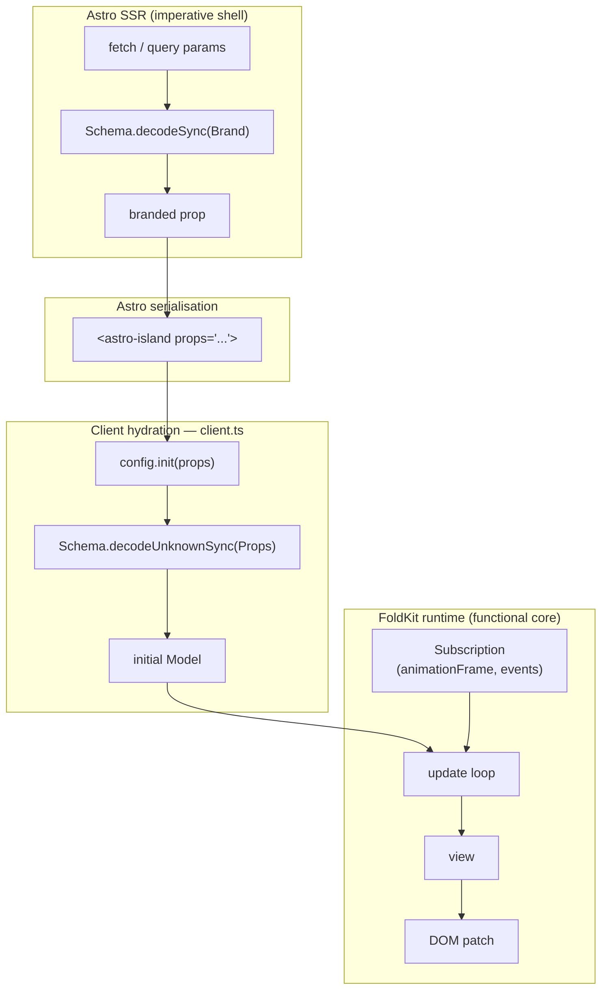

# @opsydyn/astro-foldkit

Astro integration and renderer for [FoldKit](https://foldkit.dev).

FoldKit is an Elm Architecture runtime built on [Effect](https://effect.website). This package registers FoldKit as an Astro renderer so you can drop any FoldKit app into a `.astro` page as a component and hydrate it with `client:load`.

## Installation

```sh
npm install @opsydyn/astro-foldkit
# peer deps
npm install astro foldkit
```

## FoldKit compatibility

`@opsydyn/astro-foldkit` requires FoldKit `0.129.0` or later. Applications can
use `Command.Interruptible` for request cancellation inside their own update
loop; this integration continues to own only Astro hydration and lifecycle
event delivery.

## Setup

Add the integration to `astro.config.ts`:

```ts
import { defineConfig } from 'astro/config';
import foldkit from '@opsydyn/astro-foldkit';

export default defineConfig({
  integrations: [foldkit()],
});
```

## Defining an app

Use `lazyApp` to register a FoldKit app for lazy loading. The literal loader keeps each Astro island as an explicit code-splitting boundary; it returns your `main.ts` module, which must export a value that satisfies `AppConfig`. `defineApp` remains available as a backwards-compatible alias.

```ts
// src/apps/counter/app.ts
import { lazyApp } from '@opsydyn/astro-foldkit/define-app';

export default lazyApp(() => import('./main'));
```

```ts
// src/apps/counter/main.ts
export const Model = null;
export const init = () => [0, []] as const;
export const update = (model: number, message: 'Inc' | 'Dec') =>
  [message === 'Inc' ? model + 1 : model - 1, []] as const;
export const view = (model: number) => ({
  /* foldkit view tree */
});
```

Use the app in an Astro page:

```astro
---
import Counter from '../apps/counter/app'
---
<Counter client:load />
```

The server renderer emits a deterministic `<div data-foldkit-island="true">` mount shell. It does not load or execute the FoldKit application during SSR; the application is loaded and embedded only by the client renderer. Astro still owns the outer island serialisation and client directive behavior.

The demo app's [`/request-diagnostics`](../../apps/web/src/pages/request-diagnostics.astro) page shows the integration boundary with a practical machine-driven chart workflow. The page uses `@opsydyn/astro-foldkit` for hydration, `@opsydyn/foldkit-viz` for chart primitives, and `foldkit/experimental/machine` in the application update layer.

## Passing props

`lazyApp` accepts a type parameter for the props your FoldKit app expects. This makes the component callable with typed attributes in `.astro` files.

```ts
// src/apps/greeting/app.ts
import { lazyApp } from '@opsydyn/astro-foldkit/define-app';
import type { Name } from './model';

export default lazyApp<{ name: Name }>(() => import('./main'));
```

Props are forwarded from Astro's `<astro-island>` serialisation into your `init` function. Declare `init` to accept `props: unknown` and validate at the boundary with Effect Schema:

```ts
// src/apps/greeting/model.ts
import { Schema } from 'effect';

export const Name = Schema.String.pipe(Schema.brand('Name'));
export type Name = typeof Name.Type;

const Props = Schema.Struct({ name: Name });

export const init = (props: unknown): readonly [Model, readonly []] => {
  const { name } = Schema.decodeUnknownSync(Props)(props);
  return [name, []];
};
```

Pass the branded value from the Astro page:

```astro
---
import { Schema } from 'effect'
import GreetingApp from '../apps/greeting/app'
import { Name } from '../apps/greeting/model'

const name = Schema.decodeSync(Name)(Astro.url.searchParams.get('name') ?? 'World')
---
<GreetingApp client:load name={name} />
```

The TypeScript types flow end-to-end: the `Name` brand is required at the Astro call site, and `Schema.decodeUnknownSync` re-validates the serialised value at the client hydration boundary.

## Built-in props

The renderer intercepts one reserved prop before forwarding anything to your app. It is never seen by `init`, `update`, or `view`.

### `noMeta`

Prevents the FoldKit program from overwriting `document.title`. Use this whenever you embed an app as an island on a page that manages its own title — without it, the island's view tree will update the browser tab title on every render tick.

```astro
<DashboardChart client:load noMeta data={chartData} />
```

Both `noMeta` and `noMeta={true}` are accepted. The prop is stripped before `init` receives the rest of your props.

## Architecture

### Imperative shell, functional core

The Astro page is the **imperative shell**: it performs side effects (HTTP fetches, query-param reads, URL parsing) and validates raw values into branded types via `Schema.decodeSync`. The shell hands only clean, typed values into the component.

The FoldKit app is the **functional core**: its `init`, `update`, and `view` functions are pure. They receive already-validated props, run a closed message loop, and produce a view tree — with no side effects outside of declared `Command`s and `Subscription`s.

### Data flow



The double-decode is intentional: `Schema.decodeSync` at the Astro boundary ensures the page cannot render with invalid data; `Schema.decodeUnknownSync` at the FoldKit boundary re-validates after JSON round-trip through the island serialisation, so the functional core never receives unverified input.

## AppConfig

The module returned by your loader must export:

| Export   | Type                                                           | Description                                     |
| :------- | :------------------------------------------------------------- | :---------------------------------------------- |
| `Model`  | `unknown`                                                      | Initial model type marker                       |
| `init`   | `(props: unknown) => readonly [Model, ReadonlyArray<Command>]` | Initial state from props and startup commands   |
| `update` | `(model, message) => readonly [Model, ReadonlyArray<Command>]` | Pure state transition                           |
| `view`   | `(model) => Document`                                          | Render the current model to a FoldKit view tree |

## Exports

| Entry point                         | Description                                               |
| :---------------------------------- | :-------------------------------------------------------- |
| `@opsydyn/astro-foldkit`            | Default Astro integration (`foldkit()`)                   |
| `@opsydyn/astro-foldkit/define-app` | `lazyApp` helper (`defineApp` alias) and `AppConfig` type |

The root entry point also exports the `NavigationConfig`, `NavigationEvent`, and `NavigationPhase` types.

## Embedding

`Runtime.embed` gives you a typed handle to the running program so you can clean it up on unmount and push live data in without remounting. This integration uses `embed` internally — the `astro:unmount` event calls `handle.dispose()` to tear down subscriptions and animation-frame loops when Astro navigates away.

### Declaring ports

Ports are typed channels declared in your app's `main.ts`. Pass a `Schema` for each port so values are validated at the boundary.

```ts
// src/apps/dashboard/main.ts
import { Port } from 'foldkit';
import { Schema } from 'effect';

export const ports = {
  inbound: {
    data: Port.inbound(Schema.Array(DataPointSchema)),
  },
  outbound: {
    selection: Port.outbound(Schema.NullOr(Schema.String)),
  },
};
```

### Navigation events

To receive Astro View Transition lifecycle events, declare an inbound port and a mapper in the app configuration. Astro props remain the input to `init`; navigation events are runtime messages delivered through the configured port.

```ts
// src/apps/dashboard/main.ts
import { Schema } from 'effect';
import { Port } from 'foldkit';
import type { NavigationEvent } from '@opsydyn/astro-foldkit';

export const ports = {
  inbound: {
    navigation: Port.inbound(Schema.Unknown),
  },
};

export const navigation = {
  port: 'navigation',
  map: (event: NavigationEvent) => ({
    _tag: 'Navigated' as const,
    ...event,
  }),
};
```

The mapper receives this value shape:

```ts
type NavigationEvent = {
  readonly phase: 'coldLoad' | 'entered' | 'exited' | 'stayed';
  readonly path: string;
  readonly previousPath: string | null;
};
```

The bridge sends `coldLoad` immediately for the first mount of an island identity. A retained island receives `stayed` on `astro:before-swap` when its matching `uid` exists in the incoming document, but does not receive `entered` from the following global `astro:page-load`. A same-identity remount emits `entered` on mount; an active island can also emit `entered` for a later page load when it was not retained. Every mounted island emits `exited` once on `astro:unmount`. Events contain normalized pathnames; route parsing and route-specific message decisions belong in the app mapper. If the configured inbound port is missing, the integration warns once and leaves the FoldKit runtime mounted without forwarding events.

The integration owns only lifecycle observation and port delivery. The app owns parsing `path` into its route type, mapping the event into a past-tense Message, and deciding whether an `entered` event should run a load or revalidation command. Keep that policy in `update` or a FoldKit `Transition`, so SSR props, navigation facts, and side effects remain separate.

Pass the ports map to `makeApplication` alongside your `init`, `update`, and `view`:

```ts
import { Runtime } from 'foldkit';

const program = Runtime.makeApplication({
  Model,
  init,
  update,
  view,
  container,
  devTools: false,
  ports,
});
```

### Live prop updates

Once embedded, push new data through an inbound port instead of remounting the component. This is particularly useful in Astro View Transition flows where the page shell re-runs but the island should preserve its running state:

```ts
const handle = Runtime.embed(program);

// Called when Astro soft-navigates back to this page with new data
handle.ports.data.send(nextDataPoints);
```

### Outbound subscriptions

Subscribe to outbound ports to react to events inside the program from the host page. Port names are flat on `handle.ports` regardless of whether they were declared under `inbound` or `outbound`:

```ts
const unsubscribe = handle.ports.selection.subscribe((id) => {
  // sync selection state to the URL or another island
  history.replaceState({}, '', `?selected=${id ?? ''}`);
});

element.addEventListener(
  'astro:unmount',
  () => {
    unsubscribe();
    handle.dispose();
  },
  { once: true },
);
```

## Peer dependencies

| Package   | Version   |
| :-------- | :-------- |
| `astro`   | `≥ 5.0`   |
| `foldkit` | `≥ 0.126` |

## License

MIT
