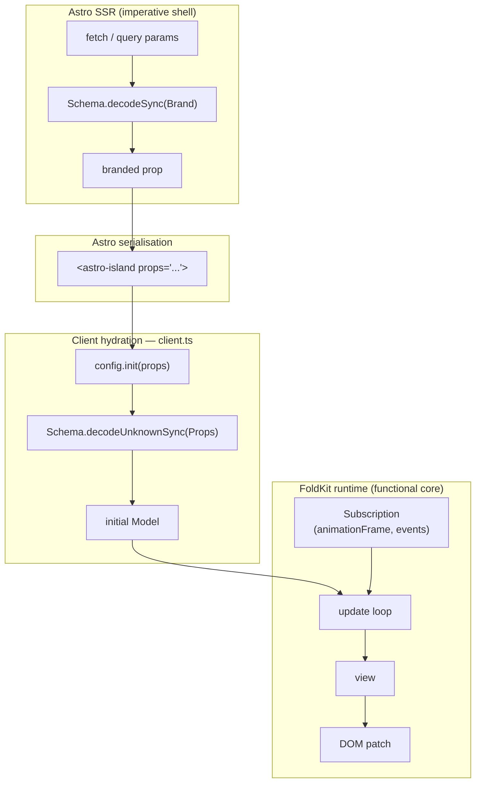

# @opsydyn/astro-foldkit

Astro integration and renderer for [FoldKit](https://foldkit.dev).

FoldKit is an Elm Architecture runtime built on [Effect](https://effect.website). This package registers FoldKit as an Astro renderer so you can drop any FoldKit app into a `.astro` page as a component and hydrate it with `client:load`.

## Installation

```sh
npm install @opsydyn/astro-foldkit
# peer deps
npm install astro foldkit
```

## Setup

Add the integration to `astro.config.ts`:

```ts
import { defineConfig } from 'astro/config'
import foldkit from '@opsydyn/astro-foldkit'

export default defineConfig({
  integrations: [foldkit()],
})
```

## Defining an app

Use `defineApp` to register a FoldKit app for lazy loading. The loader returns your `main.ts` module which must export a value that satisfies `AppConfig`.

```ts
// src/apps/counter/app.ts
import { defineApp } from '@opsydyn/astro-foldkit/define-app'

export default defineApp(() => import('./main'))
```

```ts
// src/apps/counter/main.ts
export const Model = null
export const init = () => [0, []] as const
export const update = (model: number, message: 'Inc' | 'Dec') =>
  [message === 'Inc' ? model + 1 : model - 1, []] as const
export const view = (model: number) => ({ /* foldkit view tree */ })
```

Use the app in an Astro page:

```astro
---
import Counter from '../apps/counter/app'
---
<Counter client:load />
```

## Passing props

`defineApp` accepts a type parameter for the props your FoldKit app expects. This makes the component callable with typed attributes in `.astro` files.

```ts
// src/apps/greeting/app.ts
import { defineApp } from '@opsydyn/astro-foldkit/define-app'
import type { Name } from './model'

export default defineApp<{ name: Name }>(() => import('./main'))
```

Props are forwarded from Astro's `<astro-island>` serialisation into your `init` function. Declare `init` to accept `props: unknown` and validate at the boundary with Effect Schema:

```ts
// src/apps/greeting/model.ts
import { Schema } from 'effect'

export const Name = Schema.String.pipe(Schema.brand('Name'))
export type Name = typeof Name.Type

const Props = Schema.Struct({ name: Name })

export const init = (props: unknown): readonly [Model, readonly []] => {
  const { name } = Schema.decodeUnknownSync(Props)(props)
  return [name, []]
}
```

Pass the branded value from the Astro page:

```astro
---
import { Schema } from 'effect'
import GreetingApp from '../apps/greeting/app'
import { Name } from '../apps/greeting/model'

const name = Schema.decodeSync(Name)(Astro.url.searchParams.get('name') ?? 'World')
---
<GreetingApp client:load name={name} />
```

The TypeScript types flow end-to-end: the `Name` brand is required at the Astro call site, and `Schema.decodeUnknownSync` re-validates the serialised value at the client hydration boundary.

## Architecture

### Imperative shell, functional core

The Astro page is the **imperative shell**: it performs side effects (HTTP fetches, query-param reads, URL parsing) and validates raw values into branded types via `Schema.decodeSync`. The shell hands only clean, typed values into the component.

The FoldKit app is the **functional core**: its `init`, `update`, and `view` functions are pure. They receive already-validated props, run a closed message loop, and produce a view tree — with no side effects outside of declared `Command`s and `Subscription`s.

### Data flow



The double-decode is intentional: `Schema.decodeSync` at the Astro boundary ensures the page cannot render with invalid data; `Schema.decodeUnknownSync` at the FoldKit boundary re-validates after JSON round-trip through the island serialisation, so the functional core never receives unverified input.

## AppConfig

The module returned by your loader must export:

| Export   | Type                                                           | Description                                     |
| :------- | :------------------------------------------------------------- | :---------------------------------------------- |
| `Model`  | `unknown`                                                      | Initial model type marker                       |
| `init`   | `(props: unknown) => readonly [Model, ReadonlyArray<Command>]` | Initial state from props and startup commands   |
| `update` | `(model, message) => readonly [Model, ReadonlyArray<Command>]` | Pure state transition                           |
| `view`   | `(model) => Document`                                          | Render the current model to a FoldKit view tree |

## Exports

| Entry point                         | Description                             |
| :---------------------------------- | :-------------------------------------- |
| `@opsydyn/astro-foldkit`            | Default Astro integration (`foldkit()`) |
| `@opsydyn/astro-foldkit/define-app` | `defineApp` helper and `AppConfig` type |

## Peer dependencies

| Package   | Version  |
| :-------- | :------- |
| `astro`   | `≥ 5.0`  |
| `foldkit` | `≥ 0.96` |

## License

MIT
