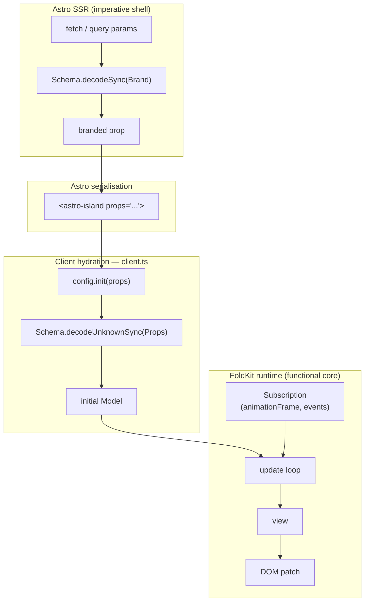

# @opsydyn/astro-foldkit

Astro integration and renderer for [FoldKit](https://foldkit.dev), with
client-only islands and an opt-in server-rendered page path.

FoldKit is an Elm Architecture runtime built on [Effect](https://effect.website). This package registers FoldKit as an Astro renderer so you can drop any FoldKit app into a `.astro` page as a component and hydrate it with `client:load`.

There are two deliberately separate entry paths:

- `lazyApp` / `defineApp` keeps the existing client-only island contract. Astro receives a deterministic mount shell and FoldKit starts in the browser.
- `definePage` opts one FoldKit application into SSG or request SSR. The server emits FoldKit HTML and public Flags, and `client:load` hydrates that exact DOM.

## Installation

```sh
npm install @opsydyn/astro-foldkit
# peer deps
npm install astro foldkit
```

## FoldKit compatibility

`@opsydyn/astro-foldkit` is tested with FoldKit `0.155.x` and the matching
`@foldkit/vite-plugin` `0.19.x` line. Applications can define interruptible
work with `Command.define(name, { interrupt: true, ... })` inside their own
update loop; this integration continues to own Astro rendering, hydration,
and lifecycle event delivery.

## Setup

Add the integration to `astro.config.ts`:

```ts
import { defineConfig } from 'astro/config';
import foldkit from '@opsydyn/astro-foldkit';

export default defineConfig({
  integrations: [
    foldkit({
      server: {
        buildId: process.env.FOLDKIT_BUILD_ID ?? 'development',
      },
    }),
  ],
});
```

The build ID is an explicit server/client handoff identity. Use a stable
deployment-specific value in production and the same value in every process
that serves the build. The integration defaults to `development` for local
use, rejects a blank value, and fails a `definePage` render closed rather than
hydrating a mismatched document when no usable identity is available.

## Defining an app

Use `lazyApp` to register a FoldKit app for lazy loading. The literal loader keeps each Astro island as an explicit code-splitting boundary; it returns your `main.ts` module, which must export a value that satisfies `AppConfig`. `defineApp` remains available as a backwards-compatible alias.

```ts
// src/apps/counter/app.ts
import { lazyApp } from '@opsydyn/astro-foldkit/define-app';

export default lazyApp(() => import('./main'));
```

```ts
// src/apps/counter/main.ts
import type { Document, HtmlBuilder } from 'foldkit/html';

type Message = 'Inc' | 'Dec';

export const Model = null;
export const init = () => ({ model: 0 });
export const update = (model: number, message: Message) =>
  ({ model: message === 'Inc' ? model + 1 : model - 1 });
export const view = (model: number, h: HtmlBuilder<Message>): Document => ({
  title: `Counter: ${model}`,
  body: h.button([h.OnClick('Inc')], [String(model)]),
});
```

Use the app in an Astro page:

```astro
---
import Counter from '../apps/counter/app'
---
<Counter client:load />
```

For `lazyApp` / `defineApp`, the server renderer emits a deterministic
`<div data-foldkit-island="true"></div>` mount shell. It does not load or
execute the FoldKit application during SSR; the application is loaded and
embedded only by the client renderer. Astro still owns the outer island
serialisation and client directive behavior.

The demo app's [`/request-diagnostics`](../../apps/web/src/pages/request-diagnostics.astro) page shows the integration boundary with a practical machine-driven chart workflow. The page uses `@opsydyn/astro-foldkit` for hydration, `@opsydyn/foldkit-viz` for chart primitives, and `foldkit/experimental/machine` in the application update layer.

## Server-rendered pages (opt-in)

Use `definePage` when one FoldKit application owns the document content for an
Astro route. It is intentionally separate from `lazyApp`: existing apps and
charts remain client-only islands unless they are explicitly migrated.

The page loader has the same literal lazy-module shape as `lazyApp`, but its
Flags factory is synchronous and receives request facts from Astro:

```ts
// src/apps/greeting/page.ts
import { definePage } from '@opsydyn/astro-foldkit/define-page';
import { Match, Schema } from 'effect';

import { Flags, type Locale, type Name } from './model';

type Props = { readonly name: Name };

const localeFromUrl = (url: URL): Locale =>
  Match.value(url.searchParams.get('locale')).pipe(
    Match.when('ar', () => 'ar' as const),
    Match.when('en', () => 'en' as const),
    Match.orElse(() => 'en' as const),
  );

export default definePage<Props, Flags>(() => import('./main'), {
  flags: ({ props, url }) =>
    Schema.decodeSync(Flags)({
      name: props.name,
      locale: localeFromUrl(url),
    }),
});
```

The loaded `main` module exports the page configuration, including the runtime
`Flags` Schema/value used by FoldKit to validate the serialized handoff:

```ts
// src/apps/greeting/main.ts
import { Message } from './message';
import { Flags, init, Model } from './model';
import { update } from './update';
import { view } from './view';

export { Flags, init, Message, Model, update, view };
```

`Flags` must be public JSON-serializable data required to create the first
Model. The factory may derive it from `request`, `url`, `params`, and validated
component `props`, but it must not return secrets, credentials, request bodies,
or runtime objects. It must not run Commands, Subscriptions, remote loads, or
browser-only resources. Server rendering is a deterministic render handoff,
not a server data-loading abstraction.

### Request SSR

Resolve the same page document in the Astro frontmatter so its FoldKit metadata
can reach the outer layout. Keep the resolver import server-only:

```astro
---
export const prerender = false;

import { Schema } from 'effect';
import { resolvePageDocument } from '@opsydyn/astro-foldkit/server';

import GreetingPage from '../apps/greeting/page';
import { Name } from '../apps/greeting/model';
import Layout from '../layouts/Layout.astro';

const name = Schema.decodeSync(Name)(Astro.url.searchParams.get('name') ?? 'astronaut');
const document = await resolvePageDocument(GreetingPage, {
  request: Astro.request,
  url: Astro.url,
  params: Astro.params,
  props: { name },
});
---

<Layout
  title={document.title}
  lang={document.lang}
  dir={document.dir}
  canonical={document.canonical}
  ogUrl={document.ogUrl}
>
  <GreetingPage client:load name={name} />
</Layout>
```

The layout owns the outer `<html>` structure and applies `title`, `lang`,
`dir`, `canonical`, and `ogUrl` from the resolved FoldKit `Document`. The
`client:load` directive is still required for an interactive page: the server
HTML contains one stamped FoldKit root and the browser hydrates that exact root
with the serialized Flags payload.

### SSG

The same page owner can be prerendered when its props and Flags are universal:

```astro
---
export const prerender = true;

import { Schema } from 'effect';
import { resolvePageDocument } from '@opsydyn/astro-foldkit/server';

import GreetingPage from '../apps/greeting/page';
import { Name } from '../apps/greeting/model';
import Layout from '../layouts/Layout.astro';

const name = Schema.decodeSync(Name)('static astronaut');
const document = await resolvePageDocument(GreetingPage, {
  request: Astro.request,
  url: Astro.url,
  params: Astro.params,
  props: { name },
});
---

<Layout
  title={document.title}
  lang={document.lang}
  dir={document.dir}
  canonical={document.canonical}
  ogUrl={document.ogUrl}
>
  <GreetingPage client:load name={name} />
</Layout>
```

An SSG error fails the build. A request-SSR error reaches Astro's error
response. The integration does not replace failed page rendering with the
client-only shell. A document may have only one `definePage` owner; use
`lazyApp` / `defineApp` for additional charts or embedded applications.

`noMeta` remains an island-only option for `defineApp`. It does not change the
page-owner metadata contract.

## Passing props

`lazyApp` accepts a type parameter for the props your FoldKit app expects. This makes the component callable with typed attributes in `.astro` files.

```ts
// src/apps/greeting/app.ts
import { lazyApp } from '@opsydyn/astro-foldkit/define-app';
import type { Name } from './model';

export default lazyApp<{ name: Name }>(() => import('./main'));
```

Props are forwarded from Astro's `<astro-island>` serialisation into your `init` function. Declare `init` to accept `props: unknown` and validate at the boundary with Effect Schema:

```ts
// src/apps/greeting/model.ts
import { Schema } from 'effect';

export const Name = Schema.String.pipe(Schema.brand('Name'));
export type Name = typeof Name.Type;

const Props = Schema.Struct({ name: Name });

export const init = (props: unknown): { readonly model: Model } => {
  const { name } = Schema.decodeUnknownSync(Props)(props);
  return { model: name };
};
```

Pass the branded value from the Astro page:

```astro
---
import { Schema } from 'effect'
import GreetingApp from '../apps/greeting/app'
import { Name } from '../apps/greeting/model'

const name = Schema.decodeSync(Name)(Astro.url.searchParams.get('name') ?? 'World')
---
<GreetingApp client:load name={name} />
```

The TypeScript types flow end-to-end: the `Name` brand is required at the Astro call site, and `Schema.decodeUnknownSync` re-validates the serialised value at the client hydration boundary.

## Built-in props

The renderer intercepts one reserved prop before forwarding anything to your app. It is never seen by `init`, `update`, or `view`.

### `noMeta`

Prevents the FoldKit program from overwriting `document.title`. Use this whenever you embed an app as an island on a page that manages its own title — without it, the island's view tree will update the browser tab title on every render tick.

```astro
<DashboardChart client:load noMeta data={chartData} />
```

Both `noMeta` and `noMeta={true}` are accepted. The wrapper pins only the
Document `title`; FoldKit still applies `lang` and `dir` from the app's current
Document.

## Architecture

`definePage` owns one server-rendered FoldKit application for a document;
`lazyApp` / `defineApp` owns an independent client island. The integration does
not infer page ownership from ordinary app markers, and adding `definePage`
does not migrate existing chart routes.

### Imperative shell, functional core

The Astro page is the **imperative shell**: it performs side effects (HTTP fetches, query-param reads, URL parsing) and validates raw values into branded types via `Schema.decodeSync`. The shell hands only clean, typed values into the component.

The FoldKit app is the **functional core**: its `init`, `update`, and `view` functions are pure. They receive already-validated props, run a closed message loop, and produce a view tree — with no side effects outside of declared `Command`s and `Subscription`s.

### Data flow


```mermaid
flowchart TD
    subgraph shell ["Astro SSR (imperative shell)"]
        A[fetch / query params] --> B["Schema.decodeSync(Brand)"]
        B --> C[branded prop]
    end

    subgraph island ["Astro serialisation"]
        C --> D["&lt;astro-island props='...'&gt;"]
    end

    subgraph hydration ["Client hydration — client.ts"]
        D --> E["config.init(props)"]
        E --> F["Schema.decodeUnknownSync(Props)"]
        F --> G[initial Model]
    end

    subgraph core ["FoldKit runtime (functional core)"]
        G --> H[update loop]
        H --> I[view]
        I --> J[DOM patch]
        K["Subscription\n(animationFrame, events)"] --> H
    end
```

The double-decode is intentional: `Schema.decodeSync` at the Astro boundary ensures the page cannot render with invalid data; `Schema.decodeUnknownSync` at the FoldKit boundary re-validates after JSON round-trip through the island serialisation, so the functional core never receives unverified input.

## AppConfig

The module returned by your loader must export:

| Export   | Type                                                           | Description                                   |
| :------- | :------------------------------------------------------------- | :-------------------------------------------- |
| `Model`  | `unknown`                                                      | Initial model type marker                     |
| `init`   | `(props: unknown) => { model: Model; commands?: ReadonlyArray<Command> }` | Initial state from props and startup commands |
| `update` | `(model, message) => { model: Model; commands?: ReadonlyArray<Command> }` | Pure state transition                         |
| `view`   | `(model, h: HtmlBuilder<Message>) => Document`                 | Render with the current render-frame builder  |

For `definePage`, `init` receives the validated `Flags` value rather than raw
Astro props, and the module must additionally export the runtime `Flags`
Schema/value. `defineApp` keeps the existing props-based `init` contract.

## Exports

| Entry point                          | Description                                               |
| :----------------------------------- | :-------------------------------------------------------- |
| `@opsydyn/astro-foldkit`             | Default Astro integration (`foldkit()`)                   |
| `@opsydyn/astro-foldkit/define-app`  | `lazyApp` helper (`defineApp` alias) and `AppConfig` type |
| `@opsydyn/astro-foldkit/define-page` | `definePage`, `PageConfig`, and page Flags context types  |
| `@opsydyn/astro-foldkit/server`      | Server-only `resolvePageDocument` metadata resolver       |

The root entry point also exports the `NavigationConfig`, `NavigationEvent`, and `NavigationPhase` types.

## Embedding

`Runtime.embed` gives you a typed handle to the running program so you can clean it up on unmount and push live data in without remounting. This integration uses `embed` internally — the `astro:unmount` event calls `handle.dispose()` to tear down subscriptions and animation-frame loops when Astro navigates away.

### Declaring ports

Ports are typed channels declared in your app's `main.ts`. Pass a `Schema` for each port so values are validated at the boundary.

```ts
// src/apps/dashboard/main.ts
import { Port } from 'foldkit';
import { Schema } from 'effect';

export const ports = {
  inbound: {
    data: Port.inbound(Schema.Array(DataPointSchema)),
  },
  outbound: {
    selection: Port.outbound(Schema.NullOr(Schema.String)),
  },
};
```

### Navigation events

To receive Astro View Transition lifecycle events, declare an inbound port and a mapper in the app configuration. Astro props remain the input to `init`; navigation events are runtime messages delivered through the configured port.

```ts
// src/apps/dashboard/main.ts
import { Schema } from 'effect';
import { Port } from 'foldkit';
import type { NavigationEvent } from '@opsydyn/astro-foldkit';

export const ports = {
  inbound: {
    navigation: Port.inbound(Schema.Unknown),
  },
};

export const navigation = {
  port: 'navigation',
  map: (event: NavigationEvent) => ({
    _tag: 'Navigated' as const,
    ...event,
  }),
};
```

The mapper receives this value shape:

```ts
type NavigationEvent = {
  readonly phase: 'coldLoad' | 'entered' | 'exited' | 'stayed';
  readonly path: string;
  readonly previousPath: string | null;
};
```

The bridge sends `coldLoad` immediately for the first mount of an island identity. A retained island receives `stayed` on `astro:before-swap` when its matching `uid` exists in the incoming document, but does not receive `entered` from the following global `astro:page-load`. A same-identity remount emits `entered` on mount; an active island can also emit `entered` for a later page load when it was not retained. Every mounted island emits `exited` once on `astro:unmount`. Events contain normalized pathnames; route parsing and route-specific message decisions belong in the app mapper. If the configured inbound port is missing, the integration warns once and leaves the FoldKit runtime mounted without forwarding events.

The integration owns only lifecycle observation and port delivery. The app owns parsing `path` into its route type, mapping the event into a past-tense Message, and deciding whether an `entered` event should run a load or revalidation command. Keep that policy in `update` or a FoldKit `Transition`, so SSR props, navigation facts, and side effects remain separate. When an app uses exited to interrupt work, the interrupt key, state, and outcome policy stay in its update loop; the integration does not cancel or replace commands.

Pass the ports map to `makeApplication` alongside your `init`, `update`, and `view`:

```ts
import { Runtime } from 'foldkit';

const program = Runtime.makeApplication({
  Model,
  init,
  update,
  view,
  container,
  devTools: false,
  ports,
});
```

### Live prop updates

Once embedded, push new data through an inbound port instead of remounting the component. This is particularly useful in Astro View Transition flows where the page shell re-runs but the island should preserve its running state:

```ts
const handle = Runtime.embed(program);

// Called when Astro soft-navigates back to this page with new data
handle.ports.data.send(nextDataPoints);
```

### Outbound subscriptions

Subscribe to outbound ports to react to events inside the program from the host page. Port names are flat on `handle.ports` regardless of whether they were declared under `inbound` or `outbound`:

```ts
const unsubscribe = handle.ports.selection.subscribe((id) => {
  // sync selection state to the URL or another island
  history.replaceState({}, '', `?selected=${id ?? ''}`);
});

element.addEventListener(
  'astro:unmount',
  () => {
    unsubscribe();
    handle.dispose();
  },
  { once: true },
);
```

## Peer dependencies

| Package   | Version               |
| :-------- | :-------------------- |
| `astro`   | `≥ 5.0`               |
| `foldkit` | `≥ 0.155.0 < 0.156.0` |

## License

MIT
